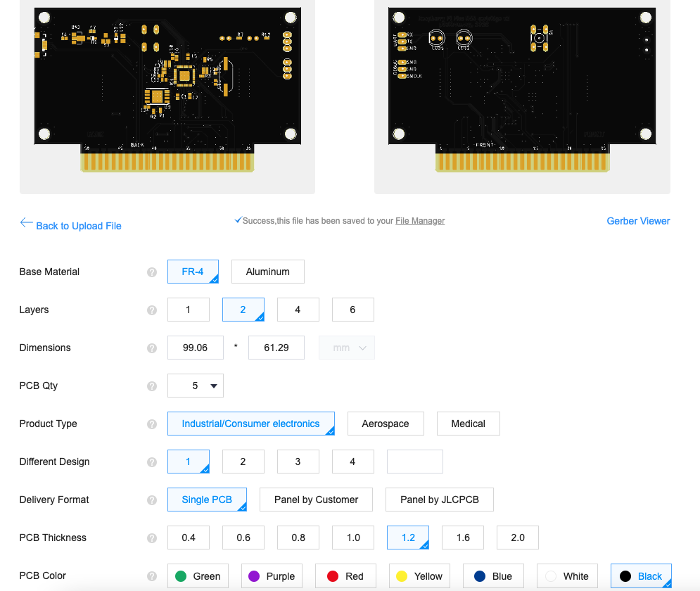

# N64cart - N64 flash cartridge

* [Intro](#intro)
* [Concept](#concept)
  * [Features](#features)
  * [Memory mapping](#memory-mapping)
* [PCB](#pcb)
  * [Order notes](#order-notes)
  * [Assembly notes](#assembly-notes)
* [Build firmware](#build-firmware)
* [Cartrigde utility](#cartrigde-utility)
  * [Build](#build)
  * [How to use](#how-to-use)
* [Total cartridge cost (32MB version)](#total-cartridge-cost-32mb-version)
* [Photos](#photos)

## Intro

Existing N64 flash cartridges are quite expensive, but thanks to Konrad Beckmann, who first used a raspberry pi pico as a memory controller, he managed to create a cheap version that can be built at home.

Hardware and firmware initially are forked from Konrad Beckmann [PicoCart64](https://github.com/kbeckmann/PicoCart64)

N64 cartridge connector footprint for Eagle CAD from [SummerCart64](https://github.com/Polprzewodnikowy/SummerCollection)

N64 ROM boot code derived from [N64FlashcartMenu](https://github.com/Polprzewodnikowy/N64FlashcartMenu) and [N64 DreamOS ROM](https://github.com/khill25/Dreamdrive64/tree/main/sw/n64)

## Concept

The main idea is to make the cartridge as simple and cheap as possible. Contrary to Konrad's idea of multiplexed PSRAM chips and two RP2040, I decided to use one SPI flash memory chip and one RP2040. Modern flash chips allow to erase and flash data more than 100,000 times, which is more than enough for home use for many years. Since the RP2040 does not support SPI flash chips larger than 16MB, it was decided to use page mode with page switching through the Extended Address register (EA register). Unfortunately, this method has a problem with long switching of 16MB pages, because need to disable the XIP mode, enable the SPI mode to change the page and enable the XIP back. Therefore, it was decided to use QSPI with 32-bit addressing mode without XIP.
To effectively work with cartridge flash chip, a special version of the filesystem was created - romfs, which allows to map sectors of saved files as a continuous data area, to which the N64 has access via the PI bus. At the moment, romfs does not support directories, is limited to 64 files and a maximum flash chip size of 64MB.

Cartridge [schematic](hw/n64cart_2022-08-16.pdf)

### Features

- The PCB and firmware supports 2, 4, 8, 16, 32 and 64 MB SPI flash chips

- One user controllable LED (accessible from N64 side)

- UART port (accessible from N64 side)

- USB utility to access to the cartridge flash chip as filesystem.

- Emulation for EEPROM 4/16Kbit

- Emulation for SRAM 256Kbit/1MBit

### Memory mapping

Registers:

Register|Address|Mode
--------|-------|----
UART_CTRL|0x1fd01000|R-
UART_RXTX|0x1fd01004|RW
LED_CTRL|0x1fd01008|-W
SYS_CTRL|0x1fd0100c|RW
SSI_SR|0x1fd01010|RW
SSI_DR0|0x1fd01014|RW
FW_SIZE|0x1fd01018|R-

UART_CTRL bits:

Function|Bit mask|Mode
--------|--------|----
UART_RX_AVAIL|0x01|R-
UART_TX_FREE|0x02|R-

UART_RXTX bits:

Function|Bit mask|Mode
--------|--------|----
DATA|0xFF|RW

LED control bits:

Function|Bit mask|Mode
--------|--------|----
LED_ONOFF|0x01|-W

SYS_CTRL bits:

Function|Bit mask|Mode
--------|--------|----
EEPROM_16KBIT|0x1000|RW
SRAM_UNLOCK|0x100|RW
FLASH_MODE_QUAD|0x10|RW
FLASH_CS_HIGH|0x01|RW

SSI_SR bits:

Function|Bit mask|Mode
--------|--------|----
SSI_SR_TFNF_BITS|0x01|R-
SSI_SR_RFNE_BITS|0x02|R-

SSI_DR0 bits:

Function|Bit mask|Mode
--------|--------|----
DATA|0xff|RW

## PCB

### Order notes

The thickness of the PCB is 1.2 mm.

Ordering a stencil will make it easier to apply solder paste, but will increase the cost of the order.

### Assembly notes

Do not solder Q1 if D2 is soldered. Use either D2 or Q1.

Do not solder R1 and R6.

After soldering, if you have used a flux when soldering a processor or a flash chip, wash it well from the board, otherwise unstable work with memory is possible or it will not work at all.

## Build firmware

To build, you will need an installed Pico SDK.

Steps to build:
```
  cd fw

  mkdir build

  cd build

  cmake ..

  make -j
```

Press the cartridge button, connect the cartridge to USB and upload 'n64cart.uf2' to the RPI-RP2 disk.

## Build rom manager

To build, you will need an installed N64 toolchain with [libdragon](https://github.com/DragonMinded/libdragon), compiled in opengl branch.

Steps to build:

```
  cd ../../rom  

  make
```

## Cartrigde utility

The utility is used to format cartridge memory, write and read files from cartridge memory. You can upload new roms, change the background pictures with utility.

### Build

To build for linux and Mac OS, you need to install the libusb development files.

```
  cd ../utils

  make
```

For windows, install mingw toolchain.

```
  cd ../utils
  
  make SYSTEM=Windows
```

### How to use

When using the utility, the console must be turned off, otherwise the cartridge memory may be corrupted and it must be formatted!

The first time you use a cartridge, you must format it and write a file manager:

```
  ./usb-romfs format

  ./usb-romfs push ../rom/n64cart-manager.z64
```

Upload some other roms, for example:

```
  ./usb-romfs push rodfsdemo.z64
```

Change background image:

```
  ./usb-romfs push picture.jpg background.jpg
```

Full list of the utility commands:

```
./usb-romfs help
./usb-romfs bootloader
./usb-romfs reboot
./usb-romfs format
./usb-romfs list
./usb-romfs delete <remote filename>
./usb-romfs push [--fix-rom][--fix-pi-bus-speed[=12..FF]] <local filename>[ <remote filename>]
./usb-romfs pull <remote filename>[ <local filename>]
```

## Total cartridge cost (32MB version)

The price of components for an online order of one or two pieces may be lower
than the cost of delivery. When ordering in several pieces, sometimes there
may even be free shipping.

Seller|Delivery cost|Components
------|-------------|---
[Chicago Electronic Distributors](https://chicagodist.com/)|$6-$11|RP2040
[Arrow](https://www.arrow.com/)|Free for orders > $50|spi flash,resistors,capacitors,etc
[jlpcb](https://jlcpcb.com/)|$22.4|PCB

The price for 5 PCB is $2 ($4 for non first in order position).

The most expensive components:

Component|qty|Price
---------|---|-----
RP2040|1|$1
W25Q256JVEIQ|1|$4.24
ABLS-12.000MHZ-B4-T|1|$0.26
UJ2-MIBH-G-SMT-TR|1|$0.45
LDI1117-3.3U|1|$0.34
BAT60AE6327HTSA1|2|$0.93

All other components (LEDs, resistors, capacitors) from home stock, total cost less than $1.

So, the total cost of the pcb and components is approximately $9.

## Photos




