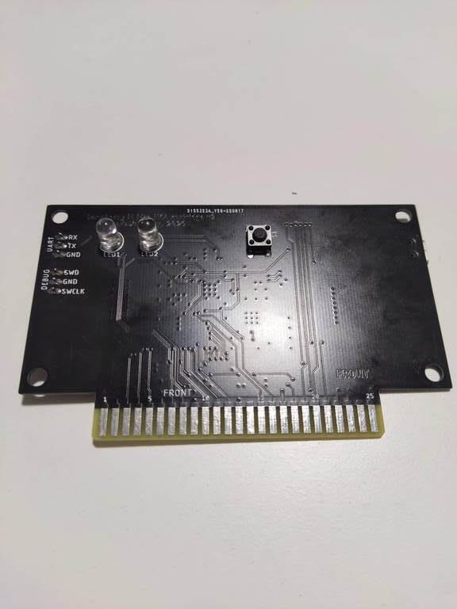
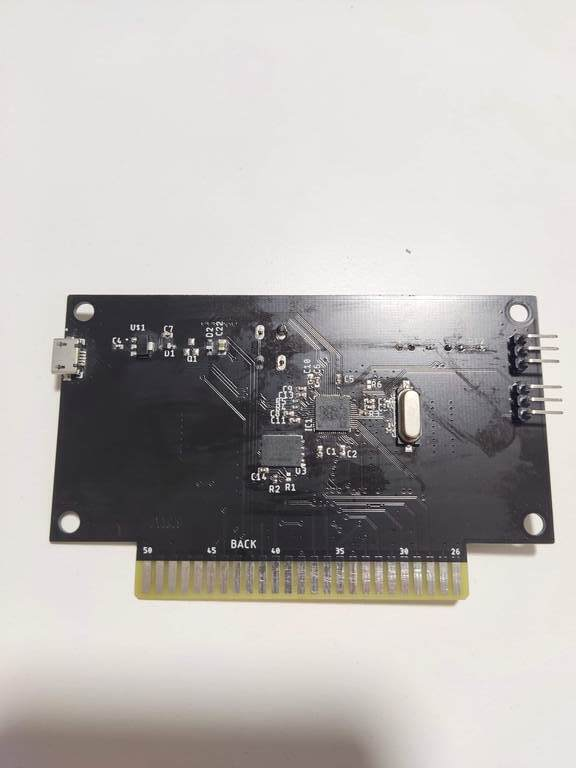
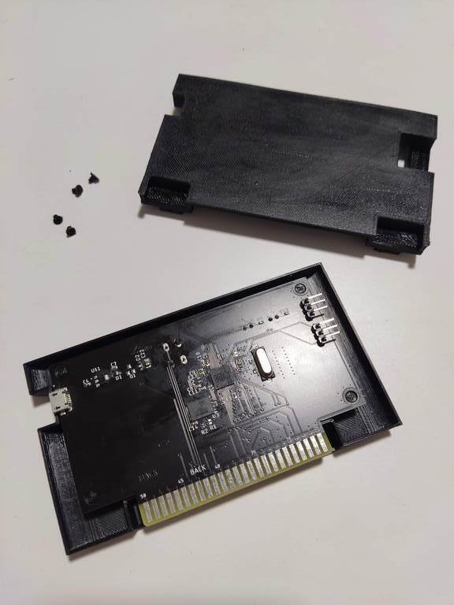
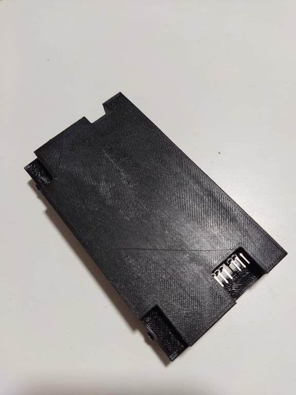
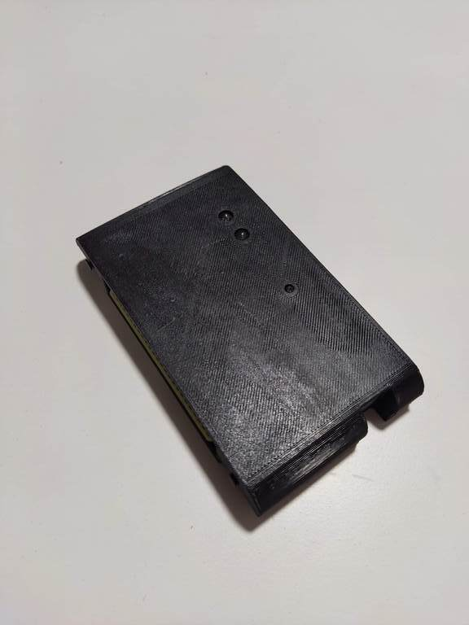
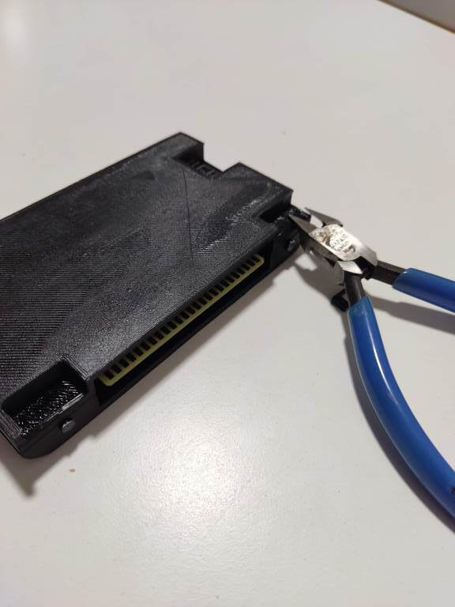
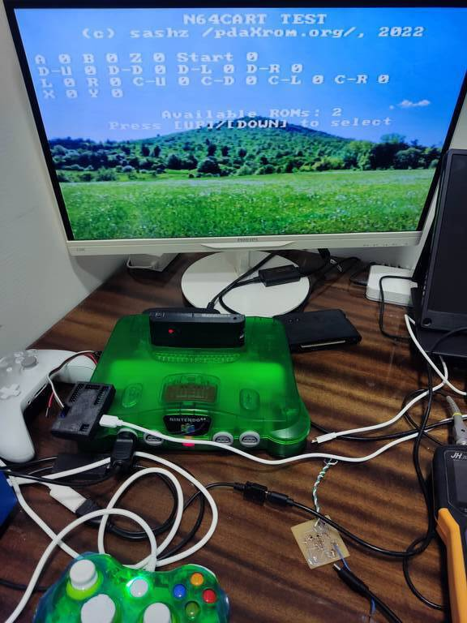

# N64cart
Raspberry Pi Pico N64 cartridge

Firmware initially is forked from Konrad Beckmann PicoCart64 https://github.com/kbeckmann/PicoCart64

## Build firmware

  cd test-rom

  make rom.h

  cd ../fw

  mkdir build

  cd build

  cmake ..

  make

Upload firmware to the cartridge.

## Cartrigde utility

You can upload new roms, change the background picture with utility.

### Build utility

  cd utils

  make

### How to use the utlity

Get cartridge info

  ./usb-uploader info

Write rom to cartrigde in ROM page 0

  ./usb-uploader rom 0 dfsdemo.z64

Change background image

  ./usb-uploader picture mybg.jpg

## Photos

