# N64cart - N64 flash cartridge

* [Intro](#intro)
* [Concept](#concept)
  * [Project files](#project-files)
  * [Features](#features)
  * [Memory mapping](#memory-mapping)
* [PCB](#pcb)
  * [Order notes](#order-notes)
  * [Assembly notes](#assembly-notes)
* [Build firmware](#build-firmware)
* [Build ROM Manager](#build-rom-manager)
* [Cartridge utility](#cartridge-utility)
  * [Build](#build)
  * [How to use](#how-to-use)
  * [Remote access to the cartridge](#remote-access-to-the-cartridge)
* [ROMFS Manager](#romfs-manager)
* [Total cartridge cost (32 MB version)](#total-cartridge-cost-32-mb-version)
* [Photos of version 2](#photos-of-version-2)
* [Bill of materials for version 3](#bill-of-materials-for-version-3)
* [Photos of version 3](#photos-of-version-3)
* [Remote access from an SGI Indy](#remote-access-from-an-sgi-indy)

## Intro

N64cart is an inexpensive N64 flash cartridge you can build at home. The hardware and firmware started as a fork of Konrad Beckmann's [PicoCart64](https://github.com/kbeckmann/PicoCart64), which uses a Raspberry Pi Pico as a memory controller.

The N64 cartridge connector footprint for Eagle CAD comes from [SummerCart64](https://github.com/Polprzewodnikowy/SummerCollection).

The N64 ROM boot code is derived from [N64FlashcartMenu](https://github.com/Polprzewodnikowy/N64FlashcartMenu) and [N64 DreamOS ROM](https://github.com/khill25/Dreamdrive64/tree/main/sw/n64).

## Concept

To keep the cartridge simple and inexpensive, I used one SPI flash chip and one RP2040. Konrad's design used multiplexed PSRAM chips and two RP2040s. Flash chips rated for more than 100,000 erase/program cycles should last for many years of home use.

The RP2040's XIP interface directly addresses up to 16 MB of flash. The early design used the Extended Address (EA) register to switch between 16 MB banks on larger chips. This was slow: each bank switch required disabling XIP, switching to SPI mode to update the register, and then re-enabling XIP. N64cart now uses QSPI with 32-bit addressing, without XIP, to avoid bank switching.

The [romfs](fw/romfs) filesystem maps the sectors of stored files into a contiguous address space that the N64 accesses through the PI bus. Maximum flash capacity depends on the board version: 64 MB for version 2 with a SOIC-8 or 8 × 6 mm WSON-8 package, and 128 MB for version 3 with a SOIC-16 package.

### Project files

#### Cartridge board version 2 (SOIC-8 / WSON-8, 8 × 6 mm; 64 MB maximum)

[Schematic (PDF)](hw/n64cart-v2-soic-8.pdf)

[Schematic (Eagle CAD)](hw/n64cart-v2-soic-8.sch)

[PCB (Eagle CAD)](hw/n64cart-v2-soic-8.brd)

[Gerber files](hw/n64cart-v2-soic-8_2024-08-11.zip)

#### Cartridge board version 3 (SOIC-16; 128 MB maximum)

[Schematic (PDF)](hw/n64cart-v3-soic-16.pdf)

[Schematic (Eagle CAD)](hw/n64cart-v3-soic-16.sch)

[PCB (Eagle CAD)](hw/n64cart-v3-soic-16.brd)

[Gerber files](hw/n64cart-v3-soic-16_2024-08-11.zip)

### Features

- One LED controlled by the N64, with WS2812 RGB support on PCB version 3 (not available on PicoCart64-lite)
- A UART port accessible from the N64 (not available on PicoCart64-lite)
- USB passthrough to the N64
- Emulation of 4/16 Kbit EEPROM
- Emulation of 256 Kbit / 1 Mbit SRAM
- Emulation of 1 Mbit FlashRAM (29L1100)
- A USB utility for accessing files on the cartridge's flash chip

### Memory mapping

#### Registers

Register|Address|Mode
--------|-------|----
UART_CTRL|0x1fd01000|R-
UART_RXTX|0x1fd01004|RW
LED_CTRL|0x1fd01008|-W
SYS_CTRL|0x1fd0100c|RW
SSI_SR|0x1fd01010|RW
SSI_DR0|0x1fd01014|RW
FW_SIZE|0x1fd01018|R-

#### UART_CTRL bits

Function|Bit mask|Mode
--------|--------|----
UART_RX_AVAIL|0x01|R-
UART_TX_FREE|0x02|R-

#### UART_RXTX bits

Function|Bit mask|Mode
--------|--------|----
DATA|0xFF|RW

#### LED control bits

Function|Bit mask|Mode|Note
--------|--------|----|---
LED_ONOFF|0x01|-W|PCB v2 or PCB v3 without WS2812
LED_RGB|0x00ffffff|-W|PCB v3 only

#### SYS_CTRL bits

Function|Bit mask|Mode
--------|--------|----
EEPROM_16KBIT|0x1000|RW
FRAM_MODE|0x200|RW
SRAM_UNLOCK|0x100|RW
FLASH_MODE_QUAD|0x10|RW
FLASH_CS_HIGH|0x01|RW

#### SSI_SR bits

Function|Bit mask|Mode
--------|--------|----
SSI_SR_TFNF_BITS|0x01|R-
SSI_SR_RFNE_BITS|0x02|R-

#### SSI_DR0 bits

Function|Bit mask|Mode
--------|--------|----
DATA|0xff|RW

## PCB

### Order notes

Use a PCB thickness of 1.2 mm.

A stencil makes it easier to apply solder paste, but adds to the order cost.

### Assembly notes

After soldering the processor and flash chip, thoroughly remove flux residue from the board. Residue can cause unstable memory operation or prevent the cartridge from working.

#### PCB version 2

Populate either D2 or Q1, but not both.

Leave R1 and R6 unpopulated.

#### PCB version 3

If LED3 is populated, leave R1 and D2 unpopulated.

## Build firmware

Install the Pico SDK before building the firmware.

The default configuration is `BOARD=v3` and `REGION=ntsc`. Pass one of these options to CMake to select a different board:

- `-DBOARD=v2`: cartridge version 2 with 32/64 MB flash.
- `-DBOARD=pico`: a generic Pico cartridge with up to 16 MB of flash, without the `SI_DAT`, `SI_CLK`, `NMI`, and `INT` signals.
- `-DBOARD=pico-lite`: a PicoCart64-lite cartridge with up to 16 MB of flash, with the `SI_DAT`, `SI_CLK`, `NMI`, and `INT` signals.

Select the firmware region according to the console:

| Console | CMake option | ROM Manager video mode |
|---|---|---|
| NTSC | `-DREGION=ntsc` (default) | NTSC |
| PAL | `-DREGION=pal` | PAL |
| PAL-M / MPAL (Brazil) | `-DREGION=ntsc` (default) | MPAL |

`REGION` selects the cartridge's CIC security protocol. PAL-M consoles use the same protocol as NTSC consoles, so choose the NTSC firmware build for PAL-M too. ROM Manager gets the console's TV type from libdragon and selects the video mode automatically. No separate PAL-M build is needed, though it still needs testing on a real PAL-M console.

From the repository root, build the default configuration:

```sh
cd fw
mkdir -p build
cd build
cmake ..
make -j
```

For example, use `cmake .. -DBOARD=v2 -DREGION=pal` to build for a version 2 cartridge and a PAL console.

Hold the cartridge's bootloader button while connecting it via USB, then copy `fw/build/n64cart.uf2` to the `RPI-RP2` drive.

## Build ROM Manager

Install an N64 toolchain with [libdragon](https://github.com/DragonMinded/libdragon) built from the `opengl` branch.

Pass `BOARD=pico` to `make` for a generic Pico cartridge, or `BOARD=pico-lite` for a PicoCart64-lite cartridge. Both configurations support flash chips of up to 16 MB. No `REGION` option is needed: video mode selection is automatic for NTSC, PAL, and PAL-M consoles.

From the repository root:

```sh
cd rom
make
```

## Cartridge utility

The utility formats cartridge memory and reads and writes files. Use it to upload ROMs or change the background image.

### Build

For Linux and macOS, install the libusb development files. From the repository root:

```sh
cd utils
make
```

To build for Windows, install the MinGW toolchain. From the repository root:

```sh
cd utils
make SYSTEM=Windows
```

### How to use

Run the following commands from the `utils` directory. Before using a new cartridge, format it and upload ROM Manager:

```sh
./usb-romfs format
./usb-romfs push ../rom/n64cart-manager.z64
```

Upload a ROM, for example:

```sh
./usb-romfs push game.z64
```

To change the background image:

```sh
./usb-romfs push picture.jpg background.jpg
```

Available commands (angle brackets indicate placeholders; square brackets indicate optional arguments):

```text
./usb-romfs help
./usb-romfs bootloader
./usb-romfs reboot
./usb-romfs format
./usb-romfs list [-h] [path]
./usb-romfs delete <remote path>
./usb-romfs mkdir <remote path>
./usb-romfs rmdir <remote path>
./usb-romfs rename <source> <destination> [--create-dirs]
./usb-romfs push [--fix-rom] [--fix-pi-bus-speed[=12..FF]] <local filename> [<remote path>]
./usb-romfs pull <remote path> [<local filename>]
./usb-romfs free
```

### Remote access to the cartridge

If your computer cannot connect to the cartridge directly, you can access it through a USB-connected proxy computer. This is useful for older systems without USB, such as an SGI Indy. Build the remote-access utilities from the `utils` directory:

```sh
make remote
```

If the client and proxy use different architectures or operating systems, cross-compile `remote-romfs` for the client by specifying the compiler:

```sh
make CC="mips-sgi-irix6o32-gcc" remote-romfs
```

Copy `remote-romfs` to the client. On the proxy computer, connect the cartridge via USB and start the proxy:

```sh
./proxy-romfs
```

On the client, `remote-romfs` takes the same commands as `usb-romfs`. Add the proxy's IP address before the command:

```text
./remote-romfs <proxy IP address> <command ...>
```

[Photos of remote access from an SGI Indy](#remote-access-from-an-sgi-indy)

## ROMFS Manager

[ROMFS Manager](utils/romfs-gui) is a desktop application built with Qt. You can use it to browse, upload, and download files on N64cart over USB or through a remote proxy.

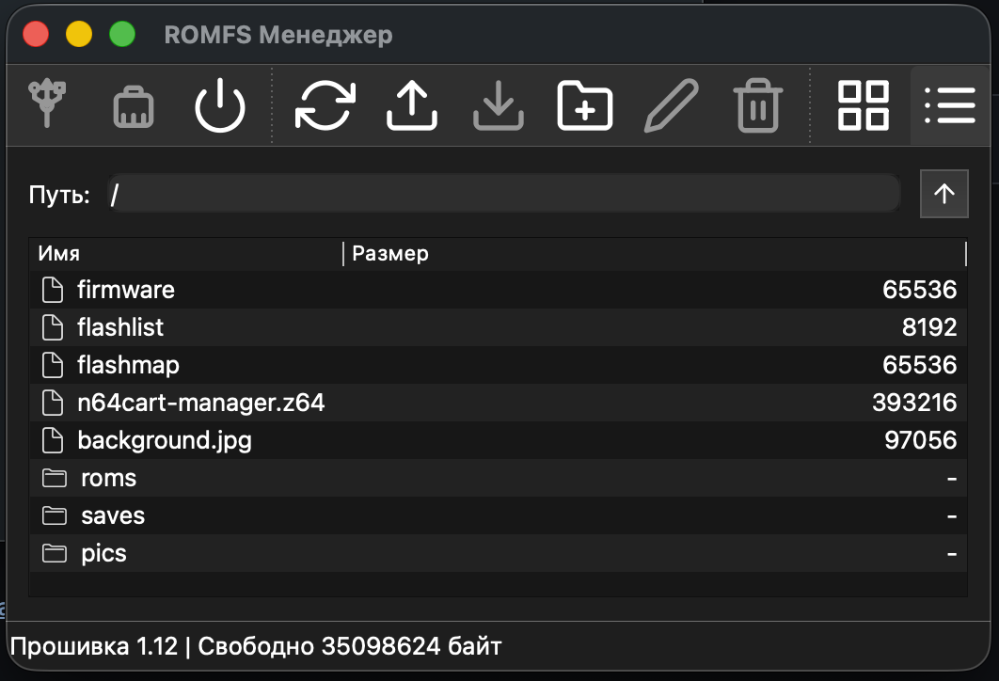

## Total cartridge cost (32 MB version)

The following is an example cost breakdown for the 32 MB version. Shipping can
cost more than the components when ordering only one or two of each item.
Larger orders may qualify for free shipping.

Seller|Delivery cost|Components
------|-------------|---
[Chicago Electronic Distributors](https://chicagodist.com/)|$6-$11|RP2040
[Arrow](https://www.arrow.com/)|Free for orders > $50|SPI flash, resistors, capacitors, etc.
[JLCPCB](https://jlcpcb.com/)|$22.40|PCB

In this example, five PCBs cost $2 for the first PCB design in an order, or $4 for each additional design.

The most expensive components:

Component|Quantity|Price
---------|---|-----
RP2040|1|$1
W25Q256JVEIQ|1|$4.24
ABLS-12.000MHZ-B4-T|1|$0.26
UJ2-MIBH-G-SMT-TR|1|$0.45
LDI1117-3.3U|1|$0.34
BAT60AE6327HTSA1|2|$0.93

The remaining components (LEDs, resistors, and capacitors) came from existing stock and cost less than $1 in total.

The estimated total cost of the PCB and components is approximately $9, excluding shipping.

## Photos of version 2

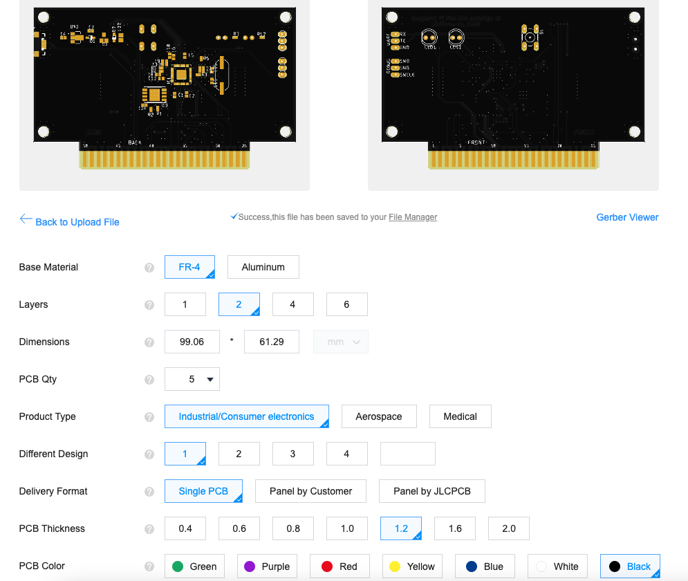

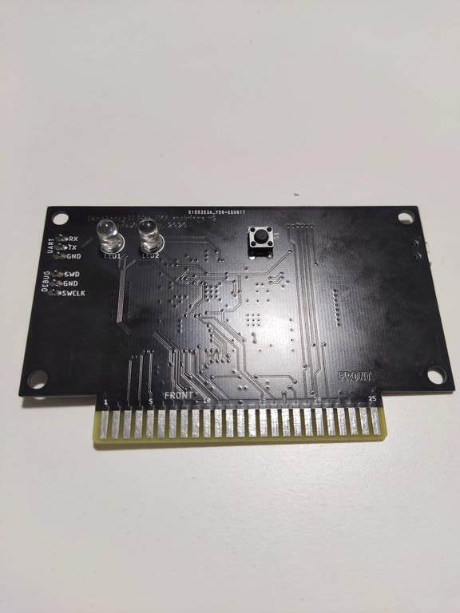

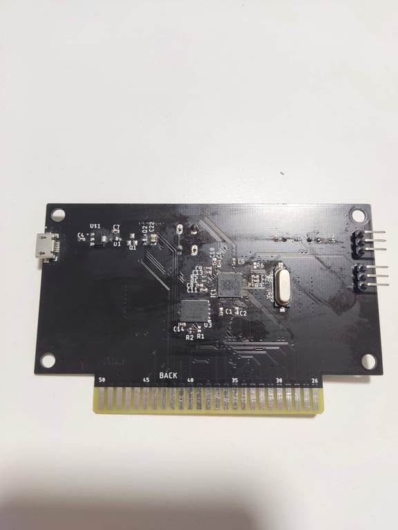

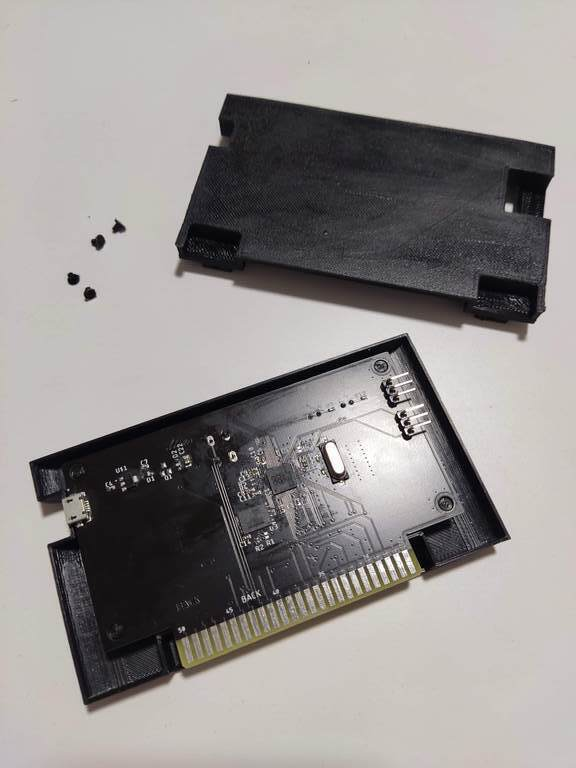

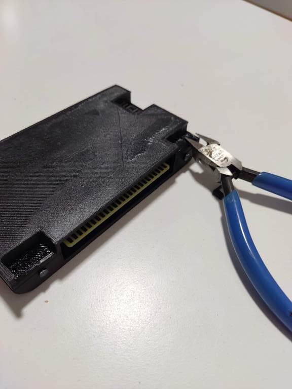

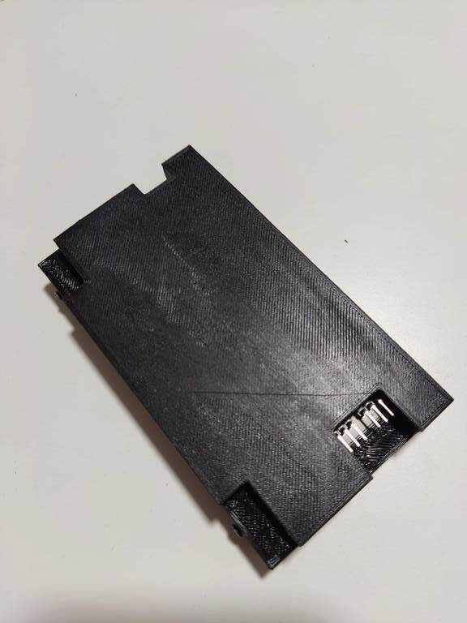

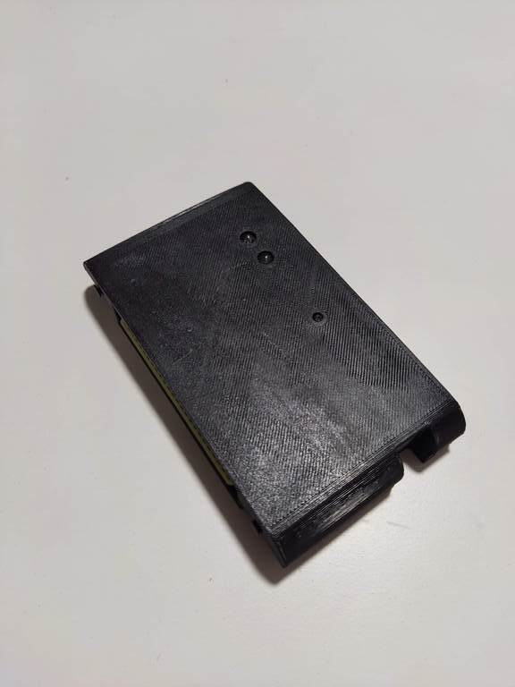

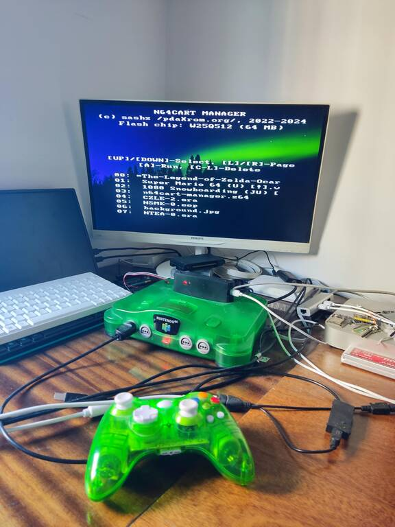

## Bill of materials for version 3

Part|Value|Device|Package
----|-----|------|-------
C1|100n|C-EUC0402|C0402
C2|100n|C-EUC0402|C0402
C3|100n|C-EUC0402|C0402
C4|100n|C-EUC0603|C0603
C5|100n|C-EUC0402|C0402
C6|100n|C-EUC0402|C0402
C7|100n|C-EUC0603|C0603
C8|100n|C-EUC0402|C0402
C9|100n|C-EUC0402|C0402
C10|1uF|C-EUC0402|C0402
C11|100n|C-EUC0402|C0402
C12|100n|C-EUC0402|C0402
C13|1uF|C-EUC0402|C0402
C14|100n|C-EUC0402|C0402
C15|27pF|C-EUC0402|C0402
C16|27pF|C-EUC0402|C0402
C22|10u|C-EUC0805|C0805
D1|SL02-GS08|SL02-GS08|SOD-123
D2|GREEN|LED0603|0603
D3|RED|LED0603|0603
IC1|RP2040-QFN56|RP2040-QFN56|QFN-56
LED3|XL-5050RGBC-WS2812B|XL-5050RGBC-WS2812B|XL5050RGBCWS2812B
Q1|BSS84|BSS84|SOT23
R1|1K|R-EU_R0603|R0603
R2|1K|R-EU_R0402|R0402
R3|1K|R-EU_R0402|R0402
R4|27|R-EU_R0402|R0402
R5|27|R-EU_R0402|R0402
R12|1K|R-EU_R0603|R0603
S1||10-XX|B3F-10XX
U$1|LDI1117-3.3U|LDI1117-3.3U|LDI1117-3.3U
U2||USB|USB-MICRO-SMD
U4|MX66L1G45GMI-08G|MX66L1G45GMI-08G|SOP_16
XTAL1|ABLS-12.000MHZ-B4-T|ABLS-12.000MHZ-B4-T|XTAL_ABLS_ABR

## Photos of version 3

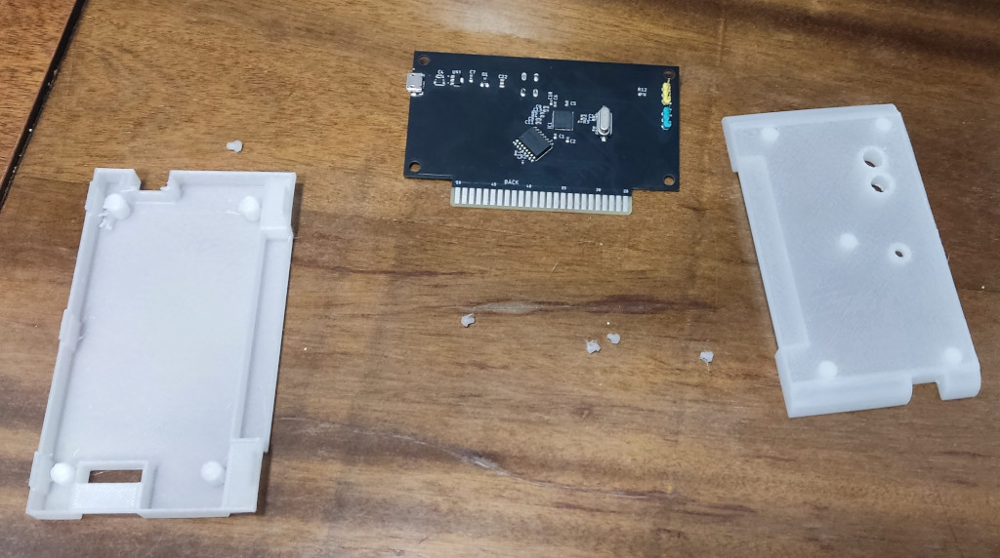

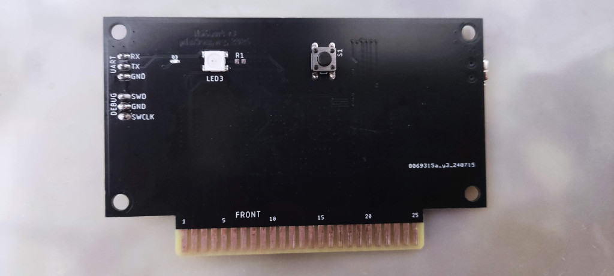

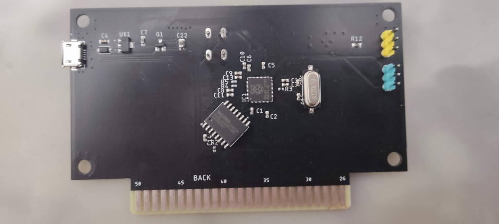

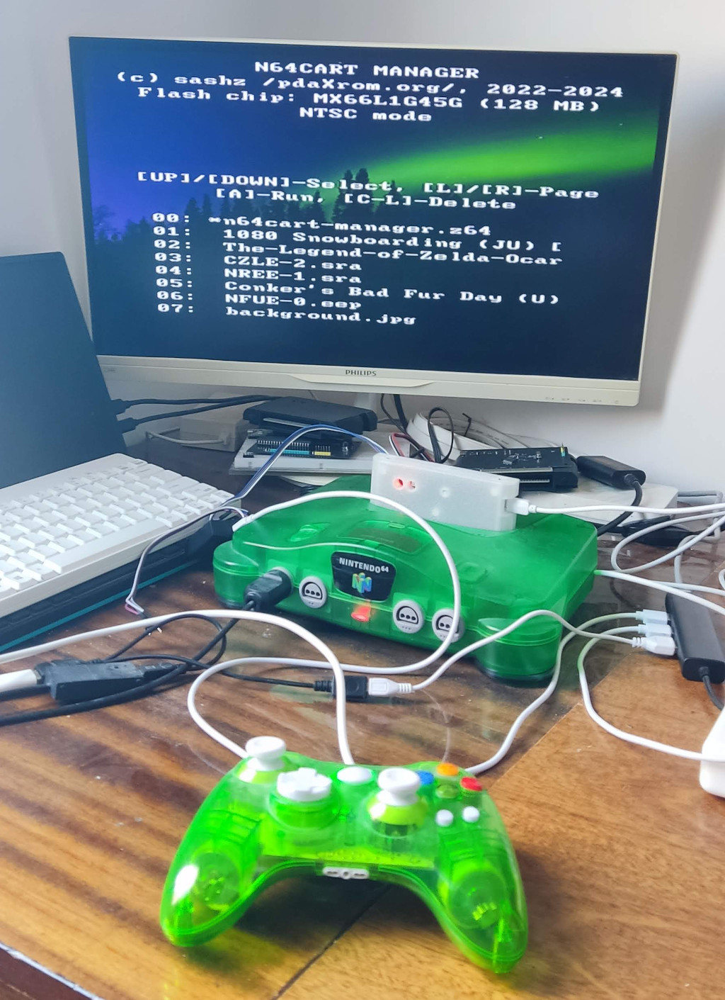

## Remote access from an SGI Indy

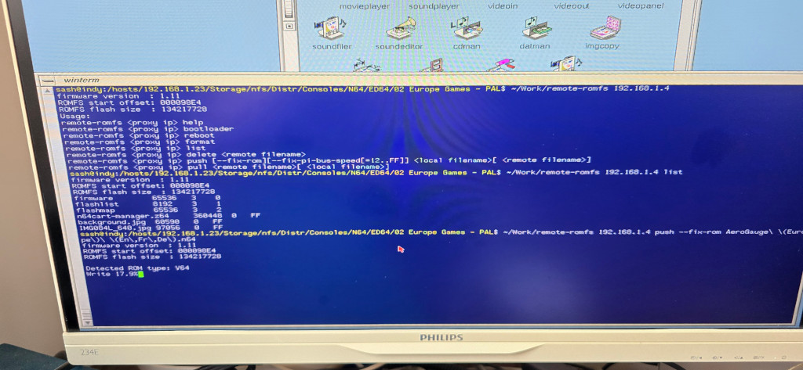

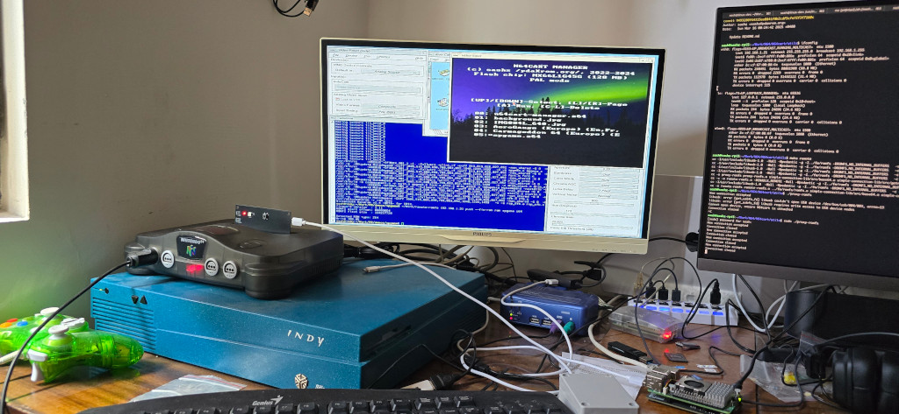

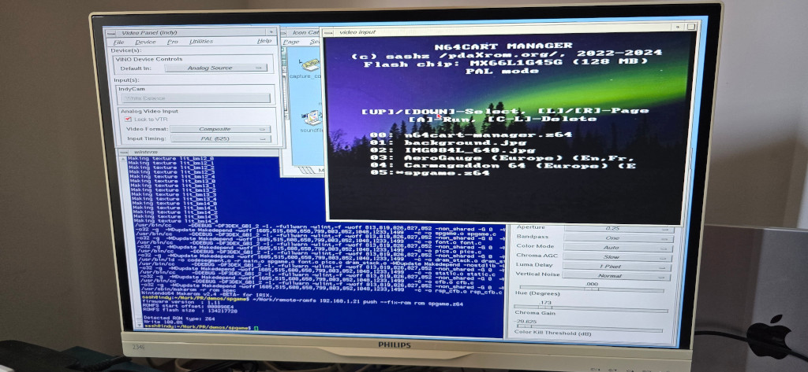
